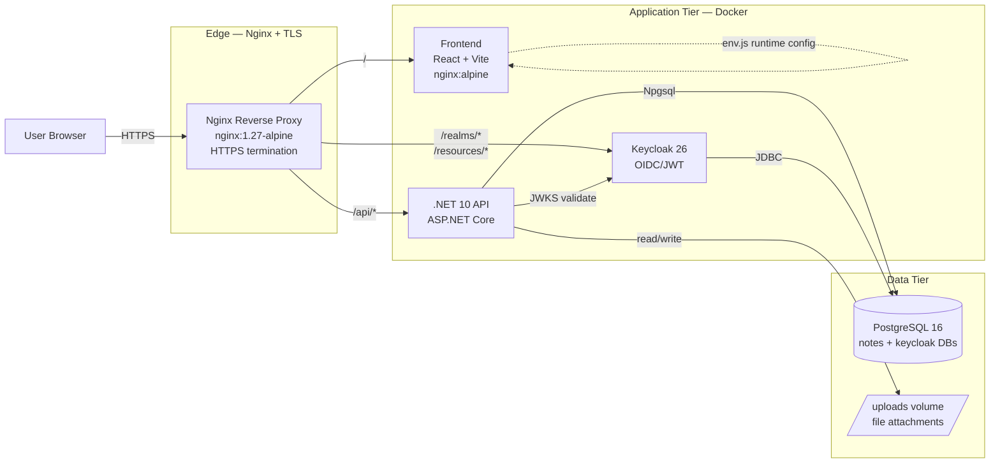
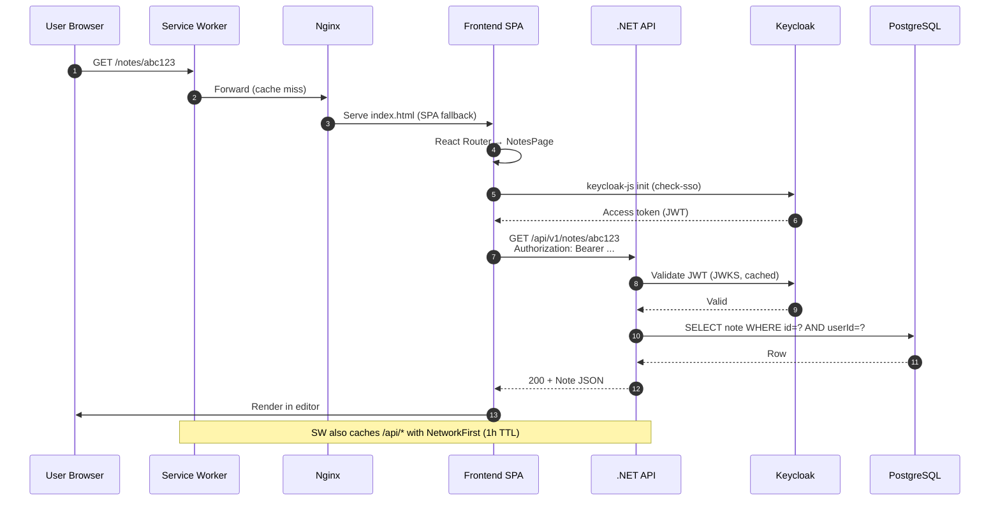

# Architecture

A server-backed, single-owner notes app. Web frontend, REST API, PostgreSQL, Keycloak for auth. Deployed as Docker containers behind Nginx.

## What it is (and isn't)

**Is:**
- Single-tenant per user (every entity has a `UserId`; ownership enforced server-side)
- API-backed (no offline mutations; reads can be served from PWA cache for ~1h)
- Redux-managed on the frontend (hand-written async thunks, not RTK Query)
- TipTap-based for rich text editing
- A PWA with installable manifest and service worker

**Isn't:**
- Offline-first or CRDT-based
- Collaborative (no real-time multi-user editing)
- Powered by a generated API client
- Backed by IndexedDB sync

See [ADRs](./adr/) for the reasoning behind each.

## System components



## Request flow — authenticated note read



## Tech stack

| Layer | Technology | Notes |
|---|---|---|
| Frontend | React 19 + TypeScript + Vite 7 | React Compiler enabled (babel plugin) |
| State | Redux Toolkit | Hand-written async thunks; see [ADR 0002](./adr/0002-redux-toolkit-not-rtk-query.md) |
| UI | MUI v6 + CSS Modules | Dynamic theme with light/dark + custom primary |
| Editor | TipTap (ProseMirror) | See [editor architecture](../ui/docs/editor-architecture.md) |
| Routing | react-router-dom v7 | `createBrowserRouter` + `ProtectedRoute` guard |
| i18n | i18next + http-backend | English + Czech, runtime-loaded from `/locales/` |
| API | .NET 10 + ASP.NET Core | Controllers + minimal API mix |
| ORM | Entity Framework Core + Npgsql | Code-first migrations |
| Database | PostgreSQL 16 | Shared between app and Keycloak (separate DBs) |
| Auth | Keycloak 26 | OIDC, PKCE, JWT bearer; see [auth.md](./auth.md) |
| Reverse proxy | Nginx 1.27 | TLS termination, SPA fallback, rate limit |
| Container | Docker + Compose | Dev = `docker-compose.yml`; prod = `docker-compose.prod.yml` |
| CI/CD | GitHub Actions + GHCR | Path-filtered builds → SSH deploy |

## Repository layout

```text
notes/
├── api/
│   ├── EpoznamkyApi/                # .NET API project
│   │   ├── Controllers/             # REST endpoints (Notes, Folders, Tags, Files, Users)
│   │   ├── Services/                # Domain services (NoteService, FolderService, ...)
│   │   ├── Models/                  # Entities + request DTOs
│   │   ├── Data/                    # AppDbContext + DesignTimeFactory
│   │   ├── Migrations/              # EF Core migrations
│   │   ├── Program.cs               # Startup, DI, middleware pipeline
│   │   └── Dockerfile
│   └── EpoznamkyApi.IntegrationTests/
├── ui/
│   ├── src/
│   │   ├── pages/                   # Route entry points
│   │   ├── features/                # Domain modules (auth, notes)
│   │   │   └── notes/
│   │   │       ├── components/      # Feature-scoped UI
│   │   │       ├── services/        # Hand-written API clients
│   │   │       ├── store/           # Slices + thunks
│   │   │       └── types/
│   │   ├── components/              # Shared UI primitives
│   │   ├── store/                   # Global slices (auth, ui, notifications, tabs)
│   │   ├── lib/                     # apiManager, apiError, utils
│   │   ├── hooks/                   # Generic custom hooks
│   │   ├── theme/                   # MUI ThemeProvider + palettes
│   │   ├── i18n/                    # i18next setup
│   │   └── config/                  # routes, env, endpoints
│   ├── public/
│   │   ├── env.js                   # Runtime config (rewritten by docker-entrypoint.sh)
│   │   ├── locales/                 # en, cs translations
│   │   └── silent-check-sso.html    # Keycloak silent SSO probe
│   ├── tests/                       # Playwright E2E
│   ├── docs/                        # Frontend-specific docs
│   ├── Dockerfile
│   └── nginx.conf                   # SPA fallback + headers (frontend container)
├── deploy/
│   └── nginx.conf                   # Edge reverse proxy (production)
├── docs/                            # ← you are here
├── scripts/                         # One-off ops scripts (Notion import, SQL dump)
├── docker-compose.yml               # Local dev stack
├── docker-compose.prod.yml          # Production stack
├── init-db.sql                      # Creates `notes` + `keycloak` databases
├── notes-dev-realm.json             # Keycloak dev realm export
└── notes-prod-realm.json            # Keycloak prod realm export
```

## Key architectural patterns

### Frontend

- **Feature folders** group all of a domain's concerns (slice + components + services + types). See [ADR 0007](./adr/0007-feature-folders-frontend.md).
- **One Axios instance** in `ui/src/lib/apiManager.ts` handles base URL, bearer injection, and 401 silent-refresh with a queued retry. Feature services consume it.
- **One active editor at a time** — `EditorPanel` mounts a single `SingleNoteEditor`; tabs are persisted but only the current one is alive in the DOM.
- **Persistence middleware** writes `ui` and `tabs` slices to `localStorage` on every dispatch; rest of state is ephemeral and reloaded from API.
- **PWA update prompt** (`registerType: 'prompt'`) is wired in `components/PwaUpdatePrompt/`. See [pwa.md](./pwa.md).

### Backend

- **Service layer pattern** without explicit interfaces — controllers hold thin orchestration, services hold business logic. DI uses concrete types.
- **Ownership enforcement** is in services, not controllers: every query filters by `UserId` from the JWT `sub` claim. See [security.md](./security.md).
- **Soft delete + sweeper** — `IsDeleted=true` flag with `DeletedAt` timestamp; `TrashCleanupService` (hosted) and `OrphanFileCleanupService` reclaim space. See [ADR 0008](./adr/0008-soft-delete-with-trash-cleanup.md).
- **Auto-migrations only in Development** — production migrations are deliberate (`dotnet ef database update`).
- **ProblemDetails everywhere** — RFC 7807 error envelope with `traceId`. Full doc: [error-handling.md](./error-handling.md).
- **Rate limiting** — global 100 req/min/user, file upload 10 req/min.

## Environments

| Environment | Frontend | API | Keycloak | DB |
|---|---|---|---|---|
| **Local dev (Vite)** | `http://localhost:5173` | `http://localhost:5001` | `http://localhost:8080` | `localhost:5432` |
| **Local dev (Docker)** | `http://localhost:3000` | `http://localhost:5001` | `http://localhost:8080` | `localhost:5432` |
| **Production** | `https://notes.nettio.eu` | `https://notes.nettio.eu/api/` | `https://auth.nettio.eu` (admin) / `https://notes.nettio.eu/realms/` (clients) | internal Docker network |

## What lives where (cheat sheet)

| I want to… | Look here |
|---|---|
| Add a REST endpoint | `api/EpoznamkyApi/Controllers/` + matching service in `Services/` |
| Add a DB column | New migration: `dotnet ef migrations add <Name>` in `api/EpoznamkyApi/` |
| Add a frontend route | `ui/src/config/routes.ts` + register in `App.tsx` |
| Add a Redux slice | `ui/src/features/<domain>/store/` |
| Add an API call | `ui/src/features/<domain>/services/` (axios via `apiManager`) |
| Customize MUI | `ui/src/theme/` |
| Add a translation | `ui/public/locales/{en,cs}/translation.json` |
| Configure auth | `notes-{dev,prod}-realm.json` + reload Keycloak |
| Change CI | `.github/workflows/deploy.yml` |
| Change deploy stack | `docker-compose.prod.yml` + `deploy/nginx.conf` |

## See also

- [Data model](./data-model.md) — entity schema and relationships
- [Auth](./auth.md) — Keycloak + JWT mechanics
- [API](./api.md) — endpoint catalog
- [Deployment](./deployment.md) — pipeline and runbook
- [ADRs](./adr/) — *why* this shape
