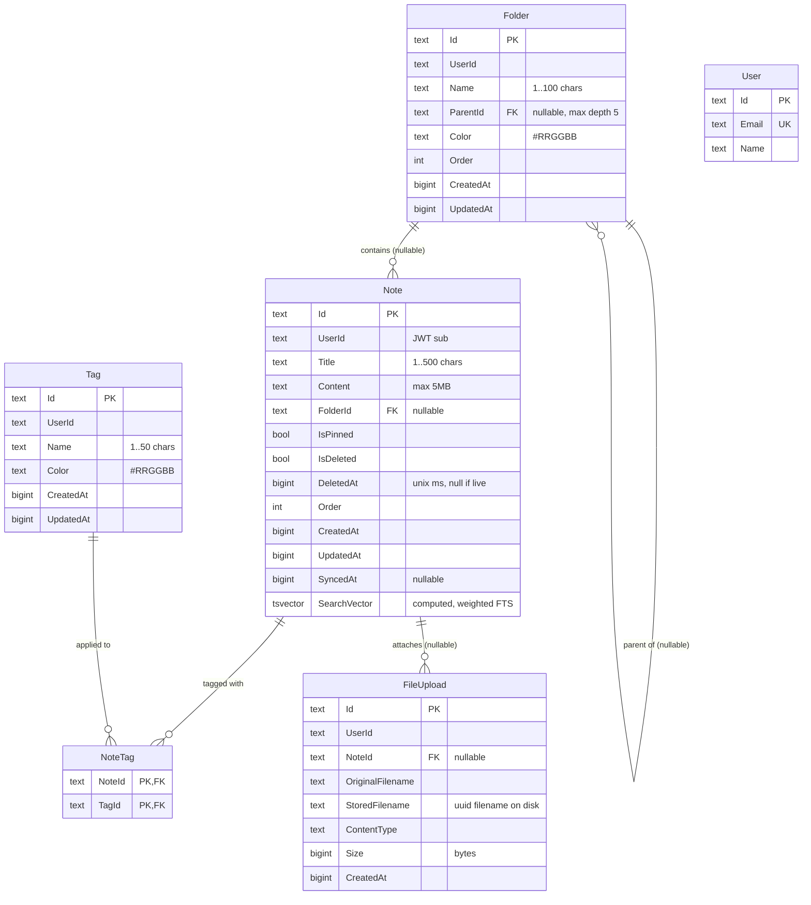

# Data Model

PostgreSQL 16 schema, owned by the `notes` database. Keycloak uses a separate `keycloak` database in the same Postgres instance.

## Conventions

- **IDs are strings**, not native `uuid`. Stored as `text` containing a `Guid.ToString()`. This makes mapping to JSON trivially symmetric across .NET ↔ JS.
- **Timestamps are `bigint` Unix milliseconds** (`long?` in C#, `number` in TS). Single source of truth; no timezone confusion. Set in entity defaults at write time.
- **Every owned entity has a `UserId` (text)** matching the Keycloak JWT `sub` claim. All queries filter by it. See [security.md](./security.md).
- **Soft delete only on `Note`** — `IsDeleted` + `DeletedAt`. Folders and tags are hard-deleted (with cascade for `NoteTag`).
- **Cascade rules** are enforced in EF (`OnDelete`):
  - `Note.FolderId` → `Folder.Id`: `SetNull` (deleting a folder unlinks its notes)
  - `Folder.ParentId` → `Folder.Id`: `Cascade` (deleting a folder removes its subtree)
  - `NoteTag.NoteId` / `NoteTag.TagId`: `Cascade`
  - `FileUpload.NoteId` → `Note.Id`: nullable, no cascade (cleanup via `OrphanFileCleanupService`)

## Entity-relationship diagram



> The `User` entity exists for any future server-side user metadata, but ownership is established by the JWT `sub` claim — not by a foreign key from `Note.UserId` to `User.Id`. Treat `UserId` as an opaque external identity.

## Indexes

Defined in `api/EpoznamkyApi/Data/AppDbContext.cs`:

| Table | Index | Purpose |
|---|---|---|
| `Notes` | `UserId` | Tenant isolation queries |
| `Notes` | `FolderId` | Folder views |
| `Notes` | `IsDeleted` | Trash filter |
| `Notes` | `DeletedAt` | Trash sweeper (`TrashCleanupService`) |
| `Notes` | `(UserId, IsDeleted)` | Compound for the most common list query |
| `Notes` | `SearchVector` (GIN) | Full-text search |
| `Folders` | `UserId` | Tenant isolation |
| `Folders` | `ParentId` | Tree walking |
| `Tags` | `UserId` | Tenant isolation |
| `FileUploads` | `UserId` | Tenant isolation |
| `FileUploads` | `NoteId` | Orphan detection |

## Full-text search

`Note.SearchVector` is a PostgreSQL `tsvector` computed from `Title` (weight A) + `Content` (weight B), with diacritics stripped via the `unaccent` extension. Built in migration `20260125000000_AddFullTextSearch` and refined in `20260216000001_AddDiacriticInsensitiveSearch`.

Queries use `ILIKE` for short fragments and `tsvector @@ websearch_to_tsquery` for full search. See `NoteService.SearchNotesAsync`.

## Validation rules (request DTOs)

These mirror the entity definitions and are enforced by ASP.NET model validation. Violation → `400` with a ProblemDetails `errors` map.

| Field | Constraint |
|---|---|
| `Note.Title` | required, 1–500 chars |
| `Note.Content` | max 5,000,000 chars (~5 MB of text) |
| `Note.FolderId` | nullable, exactly 36 chars (Guid string) if present |
| `Note.Tags` | up to 50 tag IDs |
| `Folder.Name` | required, 1–100 chars |
| `Folder.Color` | required, regex `^#[0-9a-fA-F]{6}$` |
| `Folder.ParentId` | nullable, max tree depth 5 (enforced in service, not validation) |
| `Tag.Name` | required, 1–50 chars |
| `Tag.Color` | required, regex `^#[0-9a-fA-F]{6}$` |
| File upload | max 100 MB, allowlist of extensions + content types |

## Migrations

EF Core code-first. Stored under `api/EpoznamkyApi/Migrations/`.

| Date | Name | Changes |
|---|---|---|
| 2025-12-30 | `InitialCreate` | Notes, Folders, Tags, NoteTags, Users |
| 2025-12-31 | `AddDeletedAtToNotes` | Soft delete timestamp |
| 2026-01-23 | `AddFileUploads` | `FileUploads` table |
| 2026-01-25 | `AddFullTextSearch` | `SearchVector` + GIN index |
| 2026-02-16 | `FixUnicodeEscapesInContent` | Data fix |
| 2026-02-16 | `AddDiacriticInsensitiveSearch` | `unaccent` extension + recompute vector |
| 2026-03-15 | `RemoveNoteShares` | Drop legacy share table (single-owner only) |

### Adding a migration

```bash
cd api/EpoznamkyApi
dotnet ef migrations add <DescriptiveName>
# inspect the generated *.Designer.cs and the Up/Down methods
```

In **Development**, migrations apply automatically at app startup (`Program.cs`). In **Production**, apply deliberately:

```bash
# On the deploy host, against the running DB
docker compose -f docker-compose.prod.yml exec api dotnet ef database update
```

See [deployment.md](./deployment.md#database-migrations) for the full procedure.

## Initial database setup

`init-db.sql` (mounted into the Postgres container at first start) creates two databases:

```sql
CREATE DATABASE notes;
CREATE DATABASE keycloak;
```

That's it — schema for `notes` is created by EF migrations, schema for `keycloak` is created by Keycloak on first import of the realm JSON.
