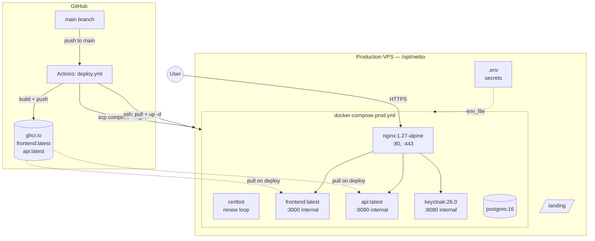

# Deployment

Production runs as Docker Compose on a single VPS, fronted by Nginx + Let's Encrypt. CI builds and pushes images to GHCR; deploy is a `scp` + `ssh` job that pulls + restarts.

## Topology



## CI/CD pipeline

`.github/workflows/deploy.yml` triggers on push to `main` (or `workflow_dispatch` with `force_build_all`).

Jobs (path-filtered via `dorny/paths-filter`):

| Job | Trigger | Action |
|---|---|---|
| `changes` | always | Determines which paths changed |
| `build-api` | `api/**` changed | Docker build → push `ghcr.io/<repo>/api:{latest, sha}` |
| `build-ui` | `ui/**` changed | Docker build → push `ghcr.io/<repo>/frontend:{latest, sha}` |
| `deploy` | any of above succeeded **or** `docker-compose.prod.yml`/`deploy/**`/`init-db.sql`/`notes-prod-realm.json` changed | scp configs to `/opt/nettio`; ssh `docker compose pull && up -d && image prune` |

If a change touches **only docs** (or another non-deploying path), the workflow runs but every build skips and `deploy` is gated off — the system is left untouched.

### Required GitHub secrets

| Secret | Used for |
|---|---|
| `GITHUB_TOKEN` | (auto) GHCR push + login |
| `VPS_HOST` | SSH target |
| `VPS_USER` | SSH user |
| `VPS_SSH_KEY` | Private key for SSH |

## Production stack

`docker-compose.prod.yml` defines six services:

| Service | Image | Purpose | Notes |
|---|---|---|---|
| `nginx` | `nginx:1.27-alpine` | TLS edge, reverse proxy, landing page | Mounts `deploy/nginx.conf`, `deploy/certbot/conf` |
| `certbot` | `certbot/certbot` | Renew Let's Encrypt every 12h | Writes into shared volume |
| `postgres` | `postgres:16` | Both `notes` and `keycloak` DBs | Volume `postgres_data`, init `init-db.sql` |
| `keycloak` | `quay.io/keycloak/keycloak:26.0` | Auth | `start --import-realm` from `notes-prod-realm.json`; `KC_HOSTNAME=https://notes.nettio.eu`, admin host `https://auth.nettio.eu`, `--proxy-headers xforwarded` |
| `api` | `ghcr.io/<repo>/api:latest` | .NET API | Volume `uploads_data:/app/uploads` |
| `frontend` | `ghcr.io/<repo>/frontend:latest` | React SPA via internal Nginx | `docker-entrypoint.sh` rewrites `env.js` from `${API_URL}`, `${KEYCLOAK_URL}`, `${KEYCLOAK_REALM}`, `${KEYCLOAK_CLIENT_ID}` |

### Required environment variables

Production reads from `/opt/nettio/.env` on the host. Template at the repo root: `.env.example`.

| Variable | Required | Notes |
|---|---|---|
| `POSTGRES_USER` | yes | Postgres superuser |
| `POSTGRES_PASSWORD` | **yes** | `:?` syntax in compose — fails fast if missing |
| `KEYCLOAK_ADMIN` | yes | Keycloak admin username |
| `KEYCLOAK_ADMIN_PASSWORD` | **yes** | `:?` syntax — fails fast if missing |
| `GITHUB_REPOSITORY` | yes | For GHCR image URI (e.g. `marekmelichar/notes`) |

The `:?` syntax means the deploy will refuse to start if those secrets are absent — this is intentional. Put them in `.env`, never in compose or git.

## Edge Nginx config

`deploy/nginx.conf` (mounted into the `nginx` container):

- HTTP → HTTPS redirect (with ACME challenge passthrough)
- TLSv1.2+, HSTS, secure ciphers
- `notes.nettio.eu`:
  - `/api/` → `api:8080`
  - `/realms/`, `/resources/`, `/js/` → `keycloak:8080` (with proxy buffer tuning)
  - everything else → `frontend:3000` (which itself does SPA fallback)
- `auth.nettio.eu` → Keycloak admin
- `client_max_body_size 101m` for the API location (matches the 100 MB upload cap + headers)

## Deploy procedures

### Standard deploy (push to main)

```bash
# Just merge to main. CI does the rest.
gh pr merge --squash <PR-number>
```

Watch the workflow:

```bash
gh run watch
# or
gh run list --workflow=deploy.yml
```

### Force rebuild everything

Useful after dependency upgrades or base image refreshes:

```bash
gh workflow run deploy.yml -f force_build_all=true
```

### Manual deploy from a workstation

If GitHub Actions is unavailable but you have SSH:

```bash
# Build locally + push to GHCR (needs PAT with write:packages)
echo "$GHCR_PAT" | docker login ghcr.io -u <username> --password-stdin
docker build -t ghcr.io/<repo>/api:latest ./api/EpoznamkyApi && docker push !$
docker build -t ghcr.io/<repo>/frontend:latest ./ui && docker push !$

# Deploy
ssh deploy@<vps> 'cd /opt/nettio \
  && docker compose -f docker-compose.prod.yml pull \
  && docker compose -f docker-compose.prod.yml up -d \
  && docker image prune -f'
```

### Rollback

Every build is also tagged with the commit SHA. To roll back:

```bash
ssh deploy@<vps>
cd /opt/nettio
# Find the SHA you want
docker images | grep -E '(api|frontend)'
# Edit docker-compose.prod.yml to pin :{sha} for the affected service
# Or override at the command line:
GITHUB_REPOSITORY=marekmelichar/notes \
  docker compose -f docker-compose.prod.yml up -d \
    --no-deps api  # or frontend
# Once stable, push a revert PR so the next CI run uses the right code.
```

## Database migrations

Migrations are **not** auto-applied in production (only Development). After a deploy that includes a new migration:

```bash
ssh deploy@<vps>
cd /opt/nettio
docker compose -f docker-compose.prod.yml exec api dotnet ef database update
```

Check schema state:

```bash
docker compose -f docker-compose.prod.yml exec api dotnet ef migrations list
```

If a migration fails halfway, **don't auto-rollback** — inspect the DB, decide whether to forward-fix (new migration) or restore from backup. See [operations.md](./operations.md#postgres-restore).

## Smoke checks after deploy

```bash
# Health
curl https://notes.nettio.eu/api/health/live   # 200 "Healthy"
curl https://notes.nettio.eu/api/health/ready  # 200 if DB reachable

# Frontend renders
curl -I https://notes.nettio.eu/               # 200
curl -I https://notes.nettio.eu/env.js         # 200, no-store

# Keycloak well-known
curl https://notes.nettio.eu/realms/notes/.well-known/openid-configuration | jq .issuer
```

If anything 5xx's, head straight to [operations.md → troubleshooting](./operations.md#troubleshooting).

## Pointers

| Concern | File |
|---|---|
| CI workflow | `.github/workflows/deploy.yml` |
| Prod compose | `docker-compose.prod.yml` |
| Edge Nginx | `deploy/nginx.conf` |
| Frontend Nginx (in-container) | `ui/nginx.conf` |
| Frontend runtime config injection | `ui/docker-entrypoint.sh` |
| Env template | `.env.example` |
| DB init | `init-db.sql` |
| Realm config (prod) | `notes-prod-realm.json` |
